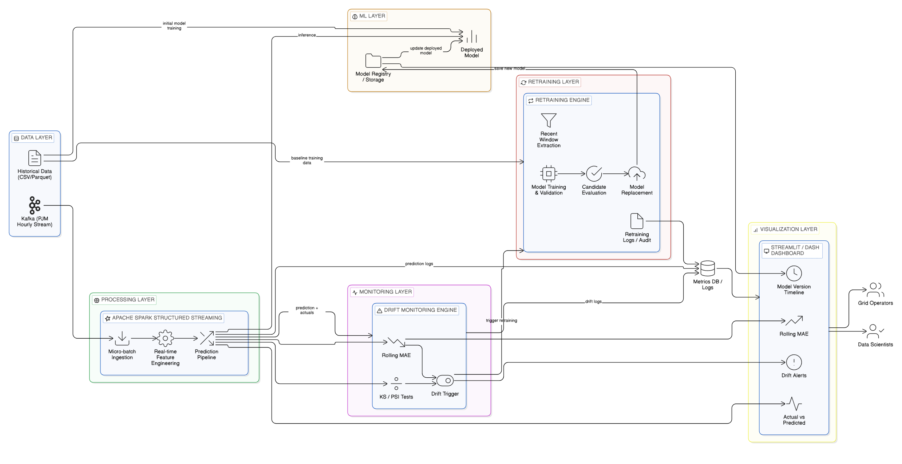

# ARCHITECTURE

Last updated: 2026-03-25

## Visual Overview



## 1) End-to-end system flow

```
RAW DATA (2018/2019 PJM zone-level CSV)
    |
    | offline_preprocess.py
    | - normalize columns
    | - parse timestamp
    | - aggregate all zones to PJM-wide load
    | - build lag/rolling/time features
    v
data/processed/pjm_supervised.parquet
    |
    | train_baseline.py
    | - chronological split 80/20
    | - XGBoost training
    | - save bundle: {model, features}
    v
artifacts/models/model_v1.joblib or model_v2.joblib

STREAMING PATH

data/processed/pjm_supervised.parquet (or raw CSV)
    |
    | kafka_producer.py
    | - if CSV: aggregate + feature engineer on-the-fly
    | - send payload with timestamp, load_mw, features{}
    v
Kafka topic: pjm.load
    |
    | spark_job.py (Structured Streaming)
    | - parse Kafka JSON payload
    | - cast feature columns to double
    | - pandas_udf inference with broadcast model
    | - strict UDF feature order from bundle["features"]
    | - compute error = abs(actual - predicted)
    v
Console debug stream (debug mode)
or
Hourly metrics parquet sink (non-debug mode)
    v
data/metrics/hourly_metrics/*.parquet
    |
    | drift_detector.py
    | - baseline window: past 7d excluding recent 24h
    | - recent window: last 24h
    | - performance_drift and prediction_drift checks
    v
artifacts/drift/drift_report.json
```

## 2) Canonical feature contract

Model and serving both use the exact order below:

```
[
  "hour_of_day",
  "day_of_week",
  "month",
  "is_weekend",
  "lag_1",
  "lag_24",
  "lag_168",
  "rolling_24",
  "rolling_168"
]
```

Current guardrail in inference:
- UDF reads `model_features = list(bundle["features"])`
- builds DataFrame from row dicts
- executes `features_df = features_df[model_features]`
- verifies column order equals `model_features`
- raises if missing columns or NaNs

## 3) Core modules

- `src/data/offline_preprocess.py`: preprocessing + aggregation + supervised feature table generation.
- `src/data/feature_builder.py`: single source for feature definitions and feature-engineering logic.
- `src/ml/train_baseline.py`: model training and artifact writing.
- `src/ml/model_io.py`: bundle loading, compatibility handling, version extraction.
- `src/streaming/kafka_producer.py`: stream simulator that can ingest supervised parquet or raw CSV.
- `src/streaming/spark_job.py`: real-time inference + debug streams + hourly aggregation.
- `src/drift_detection/drift_detector.py`: drift checks over aggregated hourly metrics.

## 4) Runtime architecture

- Windows: development and scripting.
- Docker: Kafka broker (`localhost:9092`).
- PySpark local mode (`local[*]`) for streaming inference job.

## 5) Current model deployment

Current streaming job model path:

`artifacts/models/model_v2.joblib`

The loader still supports legacy bundle compatibility, so rollback to v1 is possible by changing only model path.

