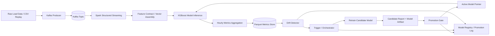

# Distributed Spark-Based Real-Time Data Drift Detection and Self-Healing ML System

## 1. 📌 Project Overview

### Problem Statement
Machine learning systems often degrade after deployment because real-world data changes over time. A forecasting model that was accurate during training can become unreliable when the underlying data distribution shifts due to seasonality, demand changes, behavioral changes, or operational drift.

This project addresses that failure mode by building a real-time streaming ML system that can:
- ingest data continuously,
- score records in near real time,
- measure prediction quality over time,
- detect drift when performance degrades,
- retrain on fresh data,
- and promote a better model automatically.

### Motivation
In domains such as electricity load forecasting, industrial monitoring, logistics, fraud detection, and recommendation systems, the data distribution is never permanently static. A model that is correct today may become stale next week.

Without automation, the usual response is manual monitoring and periodic retraining. That approach is too slow, too error-prone, and too expensive for streaming systems. This project demonstrates a closed-loop ML pipeline that behaves more like an operational system than a one-time offline model.

### High-Level Solution Summary
The system uses:
- **Kafka** as the real-time ingestion layer,
- **Spark Structured Streaming** as the distributed processing engine,
- **XGBoost** for regression-based inference,
- **parquet** for hourly metrics storage,
- **drift detection** for performance monitoring,
- **trigger/orchestrator logic** for automated decisions,
- and a **model pointer / registry** mechanism for versioned model replacement.

The core loop is:

**Ingest → Score → Aggregate Metrics → Detect Drift → Retrain → Promote → Continue**

### What Makes This System Unique
This project is not just a forecasting pipeline. It is a **self-healing ML system**.

It is unique because it combines:
- streaming inference,
- model lifecycle management,
- drift detection on stored metrics,
- candidate retraining on recent data,
- gated promotion logic,
- rollback-ready model versioning,
- and operational orchestration in a single design.

It demonstrates the full ML systems lifecycle, not just model training.

---

## 2. 🧠 System Architecture (VERY IMPORTANT)

### Architecture Summary
The system is organized as a sequential real-time pipeline with a feedback loop. The runtime execution order is:

1. `src/streaming/kafka_producer.py` replays historical CSV data into Kafka.
2. `src/streaming/spark_job.py` consumes the Kafka topic and parses the messages.
3. `src/data/feature_builder.py` defines and aligns the feature contract.
4. `src/ml/model_io.py` loads the active model bundle and feature ordering.
5. Spark performs inference and computes per-event error.
6. Spark aggregates those results into hourly parquet metrics.
7. `src/drift_detection/drift_detector.py` reads parquet metrics and computes drift.
8. `src/self_healing/orchestrator.py` loads drift status and monitor state.
9. `src/self_healing/trigger.py` evaluates whether retraining or promotion should happen.
10. `src/self_healing/retrain_pipeline.py` trains a candidate model when policy allows.
11. `src/self_healing/promotion.py` validates the candidate and updates the active pointer if approved.
12. `src/self_healing/model_registry.py` records lifecycle events for auditability.



### How the Architecture Works

#### 1. Kafka Producer
The producer replays historical CSV records as a stream of JSON events. This simulates a live data source and makes it possible to test a streaming ML pipeline without waiting for a real external system.

Code reference: [`src/streaming/kafka_producer.py`](../src/streaming/kafka_producer.py)
The producer reads the replay dataset, applies cursor/reset logic, and publishes each record to Kafka.

#### 2. Kafka Topic
Kafka decouples ingestion from processing. The producer can publish records independently while Spark consumes them asynchronously.

#### 3. Spark Structured Streaming
Spark reads the Kafka topic, parses the JSON payload, validates required features, performs inference, and writes hourly metrics.

Code reference: [`src/streaming/spark_job.py`](../src/streaming/spark_job.py)
This module contains the streaming query, the Spark UDF-based prediction path, and the hourly parquet writer.

#### 4. Feature Contract / Vector Assembly
The same canonical feature list is used for both training and inference. This prevents training-serving skew.

Code reference: [`src/data/feature_builder.py`](../src/data/feature_builder.py)
This module defines the canonical feature list and the feature-engineering logic used by both offline training and streaming inference.

#### 5. XGBoost Inference
The model predicts load using lagged and rolling time-series features. Spark applies the model per incoming event.

Code reference: [`src/ml/model_io.py`](../src/ml/model_io.py)
This module implements the active pointer resolution, model bundle loading, and version extraction used by the streaming job.

#### 6. Hourly Metrics Aggregation
The streaming job aggregates predictions into hourly summaries and writes parquet output.

Code reference: [`src/streaming/spark_job.py`](../src/streaming/spark_job.py)
This module computes the hourly aggregation and writes the parquet output.

#### 7. Drift Detection
The drift detector reads the parquet metrics, compares baseline windows against recent windows, and determines whether the model is degrading.

Code reference: [`src/drift_detection/drift_detector.py`](../src/drift_detection/drift_detector.py)
This module loads hourly parquet metrics, computes the baseline/recent windows, and writes the drift report.

#### 8. Trigger / Orchestrator
The orchestrator loads the drift report and monitoring state, evaluates policy, and decides whether retraining or promotion should happen.

Code references:
- [`src/self_healing/orchestrator.py`](../src/self_healing/orchestrator.py)
- [`src/self_healing/trigger.py`](../src/self_healing/trigger.py)

#### 9. Retrain Candidate Model
If drift is persistent enough, the orchestrator triggers retraining on a recent window of the stream CSV.

Code reference: [`src/self_healing/retrain_pipeline.py`](../src/self_healing/retrain_pipeline.py)
This module is the candidate training entry point used by the orchestrator and trigger layer.

#### 10. Promotion Gate
The candidate is only promoted if it passes the comparison gate.

Code reference: [`src/self_healing/promotion.py`](../src/self_healing/promotion.py)
This module evaluates whether the candidate should become the active production model.

#### 11. Model Registry / Promotion Log
Lifecycle events are appended for auditability and traceability.

Code reference: [`src/self_healing/model_registry.py`](../src/self_healing/model_registry.py)

---

## 3. ⚙️ Technologies Used (Big Data Focus)

### Apache Kafka
Kafka is the streaming backbone of the system.

Why Kafka is used:
- high-throughput event ingestion,
- decoupling of producer and consumer,
- buffering and replay support,
- low-latency streaming transport,
- and strong alignment with event-driven architectures.

In this project, Kafka carries load data from the producer to Spark.

### Apache Spark
Spark is the distributed computation engine.

Why Spark is used:
- it supports Structured Streaming,
- it can process continuous Kafka events,
- it can perform windowed aggregation,
- and it scales naturally to larger deployments.

In this project, Spark:
- consumes Kafka payloads,
- performs feature alignment and inference,
- and writes hourly metrics.

### Hadoop / HDFS
HDFS is not used in this local implementation.

Instead, the system stores artifacts on the local filesystem to keep the project runnable in a Windows + WSL development setup.

### Python ML Stack
The ML layer uses:
- **XGBoost** for regression,
- **pandas** for supervised dataset preparation,
- **numpy** for numerical operations,
- **joblib** for model serialization,
- and **PySpark** for distributed streaming inference.

Code references:
- [`src/data/feature_builder.py`](../src/data/feature_builder.py)
- [`src/ml/train_baseline.py`](../src/ml/train_baseline.py)
- [`src/ml/model_io.py`](../src/ml/model_io.py)
- [`src/streaming/spark_job.py`](../src/streaming/spark_job.py)

### How the System Satisfies Big Data Characteristics

#### Volume
- historical CSV data spans multiple years,
- metrics accumulate as parquet files,
- candidate models and logs accumulate over time.

#### Velocity
- records are ingested continuously,
- Spark processes them in real time,
- drift detection can run periodically.

#### Variety
- raw CSV files,
- Kafka JSON messages,
- parquet metrics,
- JSON drift reports,
- JSONL lifecycle logs.

#### Scalability
- Kafka separates ingestion from compute,
- Spark can scale out to multiple executors,
- the architecture is cluster-ready even though this repo is runnable locally.

#### Fault Tolerance
- Kafka buffers the stream,
- Spark uses checkpointing,
- model pointers preserve current production state,
- and registry logs preserve model history.

### Primary Implementation Files
For quick code navigation, the core implementation files are:
- [`src/streaming/kafka_producer.py`](../src/streaming/kafka_producer.py)
- [`src/streaming/spark_job.py`](../src/streaming/spark_job.py)
- [`src/data/feature_builder.py`](../src/data/feature_builder.py)
- [`src/ml/train_baseline.py`](../src/ml/train_baseline.py)
- [`src/ml/model_io.py`](../src/ml/model_io.py)
- [`src/drift_detection/drift_detector.py`](../src/drift_detection/drift_detector.py)
- [`src/drift_detection/drift_monitor.py`](../src/drift_detection/drift_monitor.py)
- [`src/self_healing/trigger.py`](../src/self_healing/trigger.py)
- [`src/self_healing/retrain_pipeline.py`](../src/self_healing/retrain_pipeline.py)
- [`src/self_healing/promotion.py`](../src/self_healing/promotion.py)
- [`src/self_healing/orchestrator.py`](../src/self_healing/orchestrator.py)
- [`src/self_healing/model_registry.py`](../src/self_healing/model_registry.py)
- [`src/self_healing/serving_reload.py`](../src/self_healing/serving_reload.py)
- [`scripts/maintenance/reset_pipeline.py`](../scripts/maintenance/reset_pipeline.py)

---

## 4. 🔄 Data Flow (Step-by-Step Pipeline)

### Step 1: Raw Data Ingestion
The system starts with historical load data stored in CSV files. The producer replays records in timestamp order so the rest of the system behaves like it is receiving live events.

### Step 2: Kafka Streaming
The producer converts each row into a JSON payload and publishes it to Kafka. Kafka acts as the durable queue between source and computation.

### Step 3: Spark Consumption
Spark Structured Streaming consumes Kafka messages and extracts the structured fields needed for prediction.

### Step 4: Feature Engineering
The system uses a fixed feature contract that includes temporal, lag, and rolling features.

#### Lag Features
- `lag_1`
- `lag_24`
- `lag_168`

These encode short-term, daily, and weekly history.

#### Rolling Features
- `rolling_24`
- `rolling_168`

These capture recent trend and smoother demand context over 24-hour and 168-hour windows.

#### Why These Features Are Used
Electricity demand is time dependent. Lag and rolling features help the model learn:
- short-range autocorrelation,
- daily cyclical patterns,
- weekly recurrence,
- and trend shifts.

This is a standard and effective approach for time-series forecasting.

---

## 5. 🧠 Machine Learning Pipeline

### Training

#### How the Supervised Dataset Is Built
The training pipeline converts the raw time-series dataset into a supervised learning table by:
- sorting by time,
- constructing lag and rolling features,
- aligning the feature columns to a fixed contract,
- and dropping rows where required historical values are unavailable.

#### Feature Selection
The system uses a canonical feature list defined in the feature builder. The exact order of features matters because it must match training and inference.

#### Target Variable
The target variable is `actual_load`.

The model is trained to predict the current load from recent historical context.

#### Model Used
The model is **XGBoost regression**.

Why XGBoost:
- strong performance on tabular features,
- handles nonlinear relationships well,
- robust for structured forecasting tasks,
- and practical for this kind of engineered time-series data.

#### Why No Scaling
Scaling is not required in the same way as with distance-based models because XGBoost is tree-based. The critical requirement is consistent feature ordering and correct type conversion.

### Candidate Model Training
When the system decides to retrain:
- it selects a recent time window from the stream CSV,
- reconstructs the supervised dataset,
- trains a new candidate model,
- evaluates the candidate on validation data,
- and saves the candidate model plus comparison report.

### Model Selection
Selection is based on evaluation against the active model.

The main criteria are:
- **MAE improvement**,
- RMSE non-regression,
- and promotion gate pass/fail logic.

The system does not blindly replace the current model. It promotes only if the candidate is better or at least acceptable according to policy.

---

## 6. 📡 Real-Time Inference System

### Spark UDF Usage
Spark uses a UDF to run prediction per incoming record. This allows the model to be applied within the streaming pipeline while keeping the processing flow in Spark.

### Model Loading
The model loading layer resolves the active model pointer first. If needed, it can fall back to the baseline model bundle.

This helps the system remain operational even if a pointer is missing or invalid.

### Feature Vector Alignment
Before inference, the system:
- validates the feature columns,
- checks that required features exist,
- casts values to the correct types,
- and ensures the feature order matches the model bundle.

This is essential for correctness in production ML systems.

### Prediction Generation
For each event:
1. Spark builds the feature vector.
2. The model predicts the load.
3. Spark computes the prediction error.
4. The result is either printed in debug mode or aggregated into hourly metrics in production mode.

---

## 7. 📊 Metrics & Monitoring

### What Metrics Are Stored
The production streaming job stores both row-level predictions and hourly aggregated metrics.

Row-level prediction parquet output includes:
- `timestamp`
- `actual_load`
- `predicted_load`
- `error`
- `model_version`

Current parquet columns include:
- `timestamp_hour`
- `active_model_version`
- `mean_prediction`
- `max_prediction`
- `min_prediction`
- `std_prediction`
- `mean_error`
- `max_error`
- `record_count`

### Why Aggregated Metrics Are Used
Hourly metrics provide:
- stable drift monitoring,
- lower storage overhead,
- easier reporting,
- and a clearer comparison window for recent versus baseline behavior.

### Metrics Storage Format
Parquet outputs are stored in:

`data/predictions/` (row-level scored events)

`data/metrics/hourly_metrics/`

Parquet is a good fit because it is:
- columnar,
- efficient to query,
- compact,
- and easy to reload from Python or Spark.

### Monitoring Artifacts
The system also stores supporting operational artifacts:
- drift report JSON,
- drift history JSONL,
- trigger decisions JSONL,
- candidate report JSON,
- promotion log JSONL,
- and model registry events.

---

## 8. 🚨 Drift Detection System

### Drift Type Implemented

#### Primary Drift: Performance Drift
This is the main drift signal in the system.

The detector compares baseline and recent windows using aggregated metrics. If recent error rises substantially relative to baseline, the model is likely degrading.

#### Indirect Concept Drift
The system does not explicitly learn a causal concept drift model, but sustained degradation in prediction quality is a strong operational proxy for concept drift.

### Baseline vs Recent Comparison
The drift detector:
1. loads parquet metrics,
2. sorts them by timestamp,
3. splits them into baseline and recent windows,
4. and compares their error and prediction statistics.

In practice:
- baseline window = previous 7 days,
- recent window = last 24 hours.

### Threshold Logic
The detector flags drift when recent performance deviates materially from baseline.

The practical signal used by the implementation includes:
- recent mean error significantly above baseline mean error,
- recent predictions moving materially relative to baseline statistics,
- and optionally feature drift if feature columns are available.

A common operational threshold is a strong error increase, such as recent error exceeding about **1.5x** the baseline error.

### Feature Drift Support
The detector can also compute feature drift using:
- KS statistic,
- PSI score.

However, the current production hourly metrics are aggregated summaries rather than full per-feature telemetry, so the main live signal is performance drift.

### Drift Report JSON Structure
A drift report typically includes:
- report generation timestamp,
- reference time,
- baseline window bounds,
- recent window bounds,
- drift_detected flag,
- drift_type,
- baseline_error,
- recent_error,
- baseline_mean_prediction,
- recent_mean_prediction,
- baseline_std_prediction,
- and feature drift summary information.

Example shape:

```json
{
  "report_generated_at_utc": "...",
  "reference_time_utc": "...",
  "baseline_window": {
    "start_utc": "...",
    "end_utc": "...",
    "rows": 144
  },
  "recent_window": {
    "start_utc": "...",
    "end_utc": "...",
    "rows": 24
  },
  "drift_detected": true,
  "drift_type": "performance_drift",
  "baseline_error": 1234.56,
  "recent_error": 3456.78,
  "baseline_mean_prediction": 175000.0,
  "recent_mean_prediction": 191000.0,
  "baseline_std_prediction": 12000.0,
  "feature_drift_summary": {
    "computed": false,
    "reason": "feature_columns_not_present_in_hourly_metrics"
  }
}
```

---

## 9. 🔁 Self-Healing Mechanism

### How Drift Triggers Retraining
The orchestrator inspects the drift report and monitoring state on each cycle. If drift is persistent enough, it triggers retraining.

Retraining is allowed only when:
- drift is detected,
- the drift persists long enough according to policy,
- and the cooldown period has elapsed.

### How New Data Is Collected
Retraining uses a stream CSV path and recent days window. It extracts the relevant recent data and converts it into a supervised dataset.

### How the Model Is Retrained
The candidate training pipeline:
1. loads recent data,
2. builds the feature matrix,
3. trains a new XGBoost model,
4. evaluates it against the current model,
5. and writes both the candidate artifact and comparison report.

### How the New Model Replaces the Old Model
Promotion is not immediate replacement. The candidate must pass the promotion gate.

If the candidate is approved:
- the active pointer file is updated,
- the candidate becomes production active,
- and the promotion is logged.

### Versioning
The system uses versioned model artifacts such as:
- `model_v1.joblib`,
- `model_v2.joblib`,
- `model_candidate_YYYYMMDDTHHMMSSZ.joblib`.

The active model is resolved through a pointer file so the system can support promotion and rollback safely.

### Loop Summary
The self-healing loop is:

**Detect → Retrain → Replace → Continue**

That loop is the core behavior of this project.

---

## 10. 🎛️ Orchestration Layer

### Role of the Orchestrator
The orchestrator is the control plane of the system. It coordinates the drift detector, trigger policy, retraining flow, and promotion flow.

It:
- runs drift detection,
- loads monitor state,
- evaluates the trigger decision,
- calls retraining when required,
- calls promotion when a candidate is ready,
- and writes decision logs.

### Main Modules Involved
- `src.self_healing.orchestrator`
- `src.drift_detection.drift_detector`
- `src.drift_detection.drift_monitor`
- `src.self_healing.trigger`
- `src.self_healing.retrain_pipeline`
- `src.self_healing.promotion`
- `src.self_healing.serving_reload`

### Execution Model
The orchestrator can run:
- one cycle at a time,
- or continuously on a fixed time interval.

It is parameterized by:
- interval seconds,
- required consecutive drifts,
- cooldown minutes,
- recent days,
- minimum relative improvement,
- and the stream CSV path used for retraining.

### End-to-End Coordination
The orchestrator is the operational brain of the system. It does not only detect drift. It decides what to do next and ensures that every action is logged.

---

## 11. 🧩 Codebase Breakdown

### `src/streaming`
Streaming ingestion and inference.

Key files:
- `kafka_producer.py`
  - Replays historical data into Kafka.
  - Supports reset and resume semantics.
- `spark_job.py`
  - Consumes Kafka messages.
  - Loads the model.
  - Runs prediction.
  - Writes hourly parquet metrics.
  - Supports debug and production modes.

### `src/data`
Feature engineering and supervised dataset preparation.

Key files:
- `feature_builder.py`
  - Defines the canonical feature contract.
  - Generates lag and rolling features.
  - Builds supervised training tables.

### `src/ml`
Model lifecycle and training utilities.

Key files:
- `train_baseline.py`
  - Trains the baseline regression model.
- `model_io.py`
  - Loads model artifacts.
  - Resolves active pointer state.
  - Provides a stable model loading interface.

### `src/drift_detection`
Drift analysis and monitoring.

Key files:
- `drift_detector.py`
  - Loads metrics parquet files.
  - Compares baseline and recent windows.
  - Writes drift report JSON.
- `drift_monitor.py`
  - Maintains drift history and monitor state.
  - Applies persistence and cooldown logic.

### `src/self_healing`
Decision logic and automated recovery.

Key files:
- `trigger.py`
  - Evaluates whether to retrain or promote.
- `retrain_pipeline.py`
  - Trains candidate models from recent data.
- `promotion.py`
  - Validates and promotes candidate models.
- `model_registry.py`
  - Appends lifecycle events.
- `serving_reload.py`
  - Supports post-promotion serving reload.
- `orchestrator.py`
  - Runs the unified self-healing loop.

### `scripts/maintenance`
Operational utilities.

Key files:
- `reset_pipeline.py`
  - Clears runtime outputs, checkpoints, and drift artifacts safely.

### `tests`
Test coverage for the major system pieces:
- producer logic,
- feature alignment,
- model loading,
- drift detection,
- retraining,
- trigger decisions,
- promotion gates,
- and streaming job behavior.

---

## 12. ⚠️ Challenges Faced

### Training-Serving Skew
The most common ML systems issue is mismatch between training features and inference features.

How it was solved:
- one canonical feature contract,
- ordered feature alignment in training and inference,
- and validation before Spark prediction.

### Windows vs WSL Environment Mismatch
The project is run across Windows PowerShell and WSL. That can create path and interpreter mismatches.

How it was solved:
- explicit path usage,
- explicit Spark Python interpreter settings,
- and careful workspace-root-based path resolution.

### Model Serialization
Models must be saved and reloaded across processes and sessions.

How it was solved:
- model artifacts are serialized with `joblib`,
- active model resolution is handled through the pointer file,
- and promotion writes lifecycle records for auditability.

### Feature Misalignment
Feature order matters in tree-based inference pipelines when the model expects a fixed vector.

How it was solved:
- the feature builder defines the official order,
- Spark validates the input columns,
- and the model bundle stores the feature list.

### Runtime Cleanup and Reset Reliability
Streaming jobs and checkpoints can leave behind stale runtime state.

How it was solved:
- a safe maintenance reset script,
- controlled cleanup of runtime directories,
- and repository-root-anchored path logic.

### Demo Mode vs Production Mode
Very aggressive thresholds can cause repeated retraining and repeated promotion of the same candidate.

How it was solved:
- demo settings are used only for proving behavior,
- production settings use stricter thresholds and cooldowns,
- and logs preserve the full history for review.

---

## 13. 🚀 Final System Capabilities

The system supports:
- real-time streaming inference,
- distributed ingestion through Kafka,
- Spark-based stream processing,
- parquet-based metric persistence,
- drift detection based on live operational behavior,
- automated retraining on recent data,
- gated model promotion,
- pointer-based model versioning,
- and rollback-ready lifecycle tracking.

This is a complete example of a production-style ML system, not just an offline notebook workflow.

---

## 14. 📈 Future Improvements

### Stronger Drift Metrics
Extend drift detection with:
- PSI,
- KL divergence,
- Wasserstein distance,
- and richer multivariate drift analysis.

### Dashboarding
Add a monitoring dashboard using:
- Grafana,
- or a lightweight web app,
to show:
- current metrics,
- drift status,
- active model version,
- retrain history,
- and promotion history.

### Automated Retraining Pipeline
Extend the retraining loop with:
- scheduling,
- freshness checks,
- regression testing before promotion,
- and stricter automatic release controls.

### Full Model Registry
Replace the simple JSON-based lifecycle tracking with a more formal registry layer that stores:
- artifact lineage,
- evaluation history,
- metadata,
- and deployment state.

### Cluster-Ready Deployment
Scale the current local design to:
- multi-node Spark,
- distributed storage,
- and a deployed Kafka cluster.

### Alerting and Incident Response
Add notifications for:
- severe drift,
- failed promotions,
- and serving reload failures.

---

## Conclusion
This project demonstrates a practical real-time ML system with self-healing behavior. It integrates Kafka streaming, Spark processing, XGBoost inference, metric aggregation, drift detection, retraining, promotion, and model lifecycle management into one closed-loop pipeline.

It is a strong example of how modern big data infrastructure and machine learning can be combined into a resilient, production-oriented architecture.